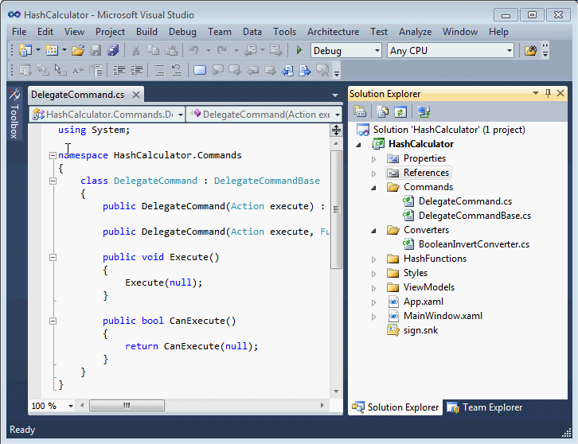

PIC OF CHALLENGE

In spirt of the Github data challenge and Stack Overflow kaggle challenge, everyone will participate in an one week data challenge.

# The Developer Interaction History Data Challenge

Programming environments offer a rich set of tools and editors for software developers to perform software engineering tasks. This dataset was created from recorded interactions of developers editing viewing, and performing tasks on code.

### Some basic statistics about data.

The data consists of about 343M of uncompressed data, in organized in several csv files.

Dataset was captured during developers' daily interactions with Visual Studio, consisting of:
* 32,811 development hours
* 196 different developers, ranging in contribution from 7 hours to 3,129 hours
* 400+ different messages, representing developer actions and events from the IDE

### Example data

In the above video the user is interested in finding all instances of the string "command" in his/her open file. To do this they press "Crtl + F", which initiates the Find and Replace dialog. The user then enters "command" into the search box. Upon each press of the "Find Next" button the user's cursor is placed at the next instance of "command" in the open file. The Blaze log created during this sequence is shown below. 



```
2017-04-12 13:35:07Z,125,View.File,WindowView,b6b68c59973bdf1415a79d79875faeffaa7d50d2,View
2017-04-12 13:35:09Z,125,View.Find and Replace,WindowView,Find and Replace,View
2017-04-12 13:35:09Z,125,Edit.Find,Immediate,Find and Replace,Navigation.Unstructured
2017-04-12 13:35:14Z,125,View.File,WindowView,b6b68c59973bdf1415a79d79875faeffaa7d50d2,View
2017-04-12 13:35:14Z,125,View.Find and Replace,WindowView,Find and Replace,View
2017-04-12 13:35:15Z,125,View.File,WindowView,b6b68c59973bdf1415a79d79875faeffaa7d50d2,View
2017-04-12 13:35:15Z,125,View.Find and Replace,WindowView,Find and Replace,View
2017-04-12 13:35:16Z,125,View.File,WindowView,b6b68c59973bdf1415a79d79875faeffaa7d50d2,View
2017-04-12 13:35:17Z,125,View.Find and Replace,WindowView,Find and Replace,View
2017-04-12 13:35:18Z,125,View.File,WindowView,b6b68c59973bdf1415a79d79875faeffaa7d50d2,View
2017-04-12 13:35:18Z,125,View.Find and Replace,WindowView,Find and Replace,View
2017-04-12 13:35:19Z,125,View.File,WindowView,b6b68c59973bdf1415a79d79875faeffaa7d50d2,View
2017-04-12 13:35:19Z,125,View.Find and Replace,WindowView,Find and Replace,View
```

#### Data Challenge Guidelines

* You can do anything you want that uses this data.
* You can supplement this data with any other sources of data.
* Some more details on [Data format](https://abb-iss.github.io/DeveloperInteractionLogs/#Data Format).
* You will commit your code and results in a github repo.
* You should integrate techniques and tools we learn in our workshops as much as possible.
* You will present your results on Tuesday afternoon using a [Pecha Kucha](http://www.pechakucha.org/) inspired format. See presentation guidelines below.

## Tim's Presentation Tips

PechaKucha or Pecha Kucha (Japanese: ペチャクチャ, IPA: [petɕa ku͍̥tɕa],[1] chit-chat) is a presentation style in which 20 slides are shown for 20 seconds each (6 minutes and 40 seconds in total). The format, which keeps presentations concise and fast-paced, powers multiple-speaker events.

#### Tips: http://www.buzzmaven.com/2010/03/pucha-kucha.html
Examples:

* http://www.pechakucha.org/presentations/data-science-for-social-good/play
* https://doublebyteblog.wordpress.com/2016/02/20/spatial-data-mining/

#### Tools (nothing hard):

* Google slides.
   * Publish
   * Set auto-advance to 20 seconds
   * Set auto-start

#### Hints: Google URLs are kinda evil.

* Get a tiny.cc account (its free)
* Start using your name (e.g. "timm"); and add a number http://tiny.cc/timm4
* When you tell people about your work, give them your name and number (e.g. "timm4").


### Inspiration

##### Examples

Just to give you one idea of an example project, Sam used [Product Hunt](https://www.producthunt.com) data to train a [startup generator](https://twitter.com/dailystartupbot), which randomly creates a new startup landing page.


Another example analysis. Best time to post on reddit.
http://ramiro.org/notebook/reddit-best-post-times/

In the above video the user is interested in finding all instances of the string "command" in his/her open file. To do this they press "Crtl + F", which initiates the Find and Replace dialog. The user then enters "command" into the search box. Upon each press of the "Find Next" button the user's cursor is placed at the next instance of "command" in the open file. The Blaze log created during this sequence is shown below. 

##### Other Data Challenges and Results

* [3rd github data challenge](https://github.com/blog/1892-third-annual-data-challenge-winners)
* [2nd github data challenge](https://github.com/blog/1544-data-challenge-ii-results)
* [1st github data challenge](https://github.com/blog/1162-github-data-challenge-winners)
* [Stack Overflow data challenge](https://www.kaggle.com/c/predict-closed-questions-on-stack-overflow)
* [Stack Overflow visualization challenge](https://www.kaggle.com/c/predict-closed-questions-on-stack-overflow/prospector#213)
