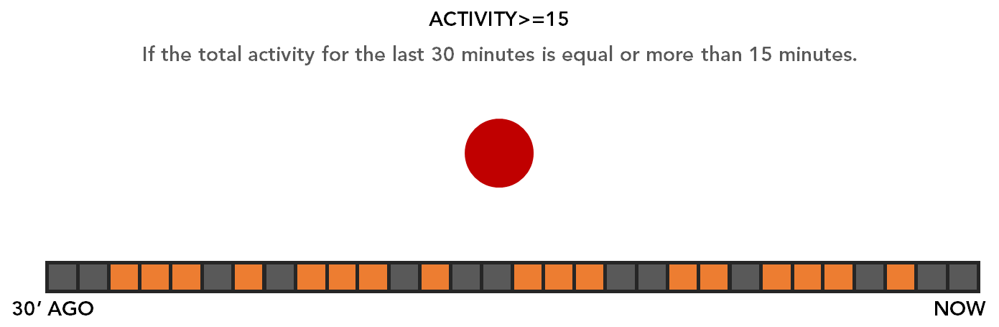

# NC State REU Data Challenge

The REU Bootcamp will introduce you to tools and practices of working with datasets to support your REU work.  To get started working with larger data sets, you're going to participate in the REU Data Challenge!  You'll have the opportunity to explore an existing dataset and work that has been reported about that data set to either 1) find your own insights or 2) to replicate existing work.  Both are valuable for understanding the larger phenomenon of how to develop good software and how to train students to be good computer scientists.

You'll have the opportunity to present your REU Data Challenge (or the start of your summer project) at the REU Bootcamp Presentations on June 6th!  

## Data Challenge Datasets

There are two possible datasets to explore for the Summer 2018 Data Challenge. 

### MSR 2018 Mining Challenge
Most of the Science of Software faculty mentors are at [ICSE 2018](https://www.icse2018.org/) this week.  ICSE is the premier software engineering conference and is a week long celebration of software engineering and several co-located events.  One co-located event is [Mining Software Repositories (MSR)](https://2018.msrconf.org/home).  Each year, MSR has a [Mining Challenge](https://2018.msrconf.org/track/msr-2018-Mining-Challenge) where a dataset is provided to MSR researchers to explore and report back on.  You will have the opportunity to work with this year's MSR datasets are from the [KaVE Project](http://www.kave.cc/datasets).  

  * Static Repository Data: contains static repository course code data that has been transformed into simplified syntax trees for analysis. 
  * Interaction Data: contains data for how users have interacted with the Visual Studio IDE when using the [FeedBaG++](http://www.kave.cc/feedbag) interaction tracker. 
  
You may explore the dataset following the [MSR 2018 Mining Challenge](https://2018.msrconf.org/track/msr-2018-Mining-Challenge) instructions.  You may also replicate one of the papers accepted to the MSR Data Challenge track.  Use the Pre-print links to access the papers or NCSU's Library to access the ACM and IEEE Databases. 

### ASSISTments Data Mining Challenge

ASSISTments is a blended learning platform to support student learning in multiple subjects.  The data set you're exploring was part of the [2017 Data Mining Competition](https://sites.google.com/view/assistmentsdatamining/data-mining-competition-2017) and contains longitudinal information about middle-school students using the ASSISTments intelligent tutoring system for math and the paths these students took through high school and through college.  

You may explore the dataset following the [ASSISTments Data Mining Competition instructions](https://sites.google.com/view/assistmentsdatamining/data-mining-competition-2017?authuser=0) There are [prior studies](https://sites.google.com/view/assistmentsdatamining/prior-studies?authuser=0) that you can replicate.

## Data Challenge Guidelines

The general goal of the data challenge is to explore and analyze the data in order to learn a new insight or to replicate an existing study, while practicing some of the skills taught during the bootcamp.

* You can do anything you want that uses this data.
* You can supplement this data with any other sources of data.
* You will commit your code and results in a github repo. [DO NOT POST THE RAW DATA PUBLICALLY - see terms of use for the datasets.]
* You should integrate techniques and tools we learn in our workshops as much as possible.
* You will present your results on Wednesday (June 6) afternoon.
* Your presentation should be 5-7 minutes.

## Tim's Presentation Tips

[PechaKucha](http://www.buzzmaven.com/2010/03/pucha-kucha.html) or Pecha Kucha (Japanese: ペチャクチャ, IPA: [petɕa ku͍̥tɕa], chit-chat) is a presentation style in which 20 slides are shown for 20 seconds each (6 minutes and 40 seconds in total). The format, which keeps presentations concise and fast-paced, powers multiple-speaker events.

(This is one possible format you can use for your presentation, but you're welcome to use a presentation format that best supports your discussion of your data challenge results.)

### Tips: 

Examples:

* http://www.pechakucha.org/presentations/data-science-for-social-good/play
* https://doublebyteblog.wordpress.com/2016/02/20/spatial-data-mining/

### Tools (nothing hard):

* Google slides.
   * Publish
   * Set auto-advance to 20 seconds
   * Set auto-start

### Hints: Google URLs are kinda evil.

* Get a tiny.cc account (its free)
* Start using your name (e.g. "timm"); and add a number http://tiny.cc/timm4
* When you tell people about your work, give them your name and number (e.g. "timm4").

## Inspiration

### Analysis Examples

[How Are Java Software Developers Using the Eclipse IDE?](https://pdfs.semanticscholar.org/6dd3/8e533bf912364f8d5af73f66c67263933dd5.pdf)

[A field study of how developers locate features in source code](http://damevski.github.io/files/icse-2016-field-study.pdf)

[How Highly Focused Developers Use the Web](http://blog.codealike.com/how-highly-focused-developers-use-the-web/)

[Best time to post on reddit](http://ramiro.org/notebook/reddit-best-post-times/)

### Applications

[When is it okay to interrupt a programmer?](http://blog.codealike.com/when-ok-interrupt-developer/)

Samim used [Product Hunt data](https://www.producthunt.com) to train a startup generator [twitter bot](https://twitter.com/dailystartupbot), which randomly creates a [new startup landing page](https://startupbot.github.io/BeforeBreakfast/).

## Other Data Challenges and Results

* [Product Hunt Dataset](https://www.producthunt.com)
* [ABB Developer Interaction Dataset](https://github.com/abb-iss/DeveloperInteractionLogs/)
* [3rd github data challenge](https://github.com/blog/1892-third-annual-data-challenge-winners)
* [2nd github data challenge](https://github.com/blog/1544-data-challenge-ii-results)
* [1st github data challenge](https://github.com/blog/1162-github-data-challenge-winners)
* [Stack Overflow data challenge](https://www.kaggle.com/c/predict-closed-questions-on-stack-overflow)
* [Stack Overflow visualization challenge](https://www.kaggle.com/c/predict-closed-questions-on-stack-overflow/prospector#213)
